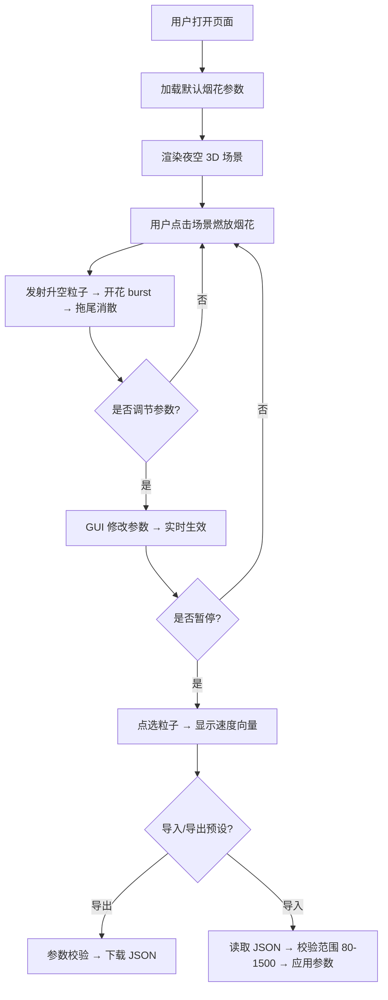

## 1. 产品概述
营地闭营晚会烟花效果模拟器，使用 Three.js 在浏览器中可视化烟花燃放效果，降低真机试放成本。支持参数调节、暂停调试、预设导入导出。
- 目标用户：烟花设计师、活动策划者、晚会筹备人员
- 核心价值：在虚拟环境中低成本调试烟花的升空高度、开花半径、拖尾时长等关键参数

## 2. 核心特性

### 2.1 功能模块
1. **3D 夜空场景**：Three.js 渲染的简化夜空，含星空背景与地面参考
2. **烟花粒子系统**：点击触发多组粒子 burst，配合发光光晕效果
3. **参数控制面板**：右侧 GUI 面板调节烟花参数
4. **粒子调试功能**：暂停状态下点选粒子查看速度向量
5. **预设管理**：JSON 格式预设导入/导出，带参数校验

### 2.2 页面详情
| 页面名称 | 模块名称 | 功能描述 |
|-----------|-------------|---------------------|
| 主界面 | 3D 场景画布 | 全屏 Three.js 夜空场景，鼠标点击燃放烟花 |
| 主界面 | 右侧 GUI 面板 | 参数调节：粒子数量、持续时间、重力、颜色渐变、间隔秒数 |
| 主界面 | 工具栏 | 播放/暂停、清除烟花、导入预设、导出预设 |
| 主界面 | 粒子调试层 | 暂停时点击粒子显示速度向量箭头 |

## 3. 核心流程

## 4. 用户界面设计

### 4.1 设计风格
- **主色调**：深蓝夜空 `#0a0a1a`，烟花亮色（金、红、青、紫渐变）
- **点缀色**：控制面板半透明玻璃拟态 `rgba(20, 20, 40, 0.85)`
- **字体**：标题使用 Orbitron（科技感），正文使用 JetBrains Mono（等宽代码风）
- **布局**：左侧全屏 3D 画布，右侧 320px 固定宽度控制面板
- **交互风格**：深色科技感，霓虹发光边框，参数变化带微动效

### 4.2 页面设计概览
| 页面名称 | 模块名称 | UI 元素 |
|-----------|-------------|-------------|
| 主界面 | 3D 场景 | 星空粒子背景、径向渐变雾效、地平线微光 |
| 主界面 | GUI 面板 | 折叠分组面板：发射参数、开花参数、颜色参数、预设管理 |
| 主界面 | 速度向量 | 暂停时点击粒子显示带箭头的彩色速度线，标注速度值 |
| 主界面 | 烟花粒子 | 升空拖尾 + 球形 burst + 闪烁光晕 + easing 缓动消散 |

### 4.3 响应式
- 桌面端优先：右侧固定面板，画布自适应剩余空间
- 小屏幕：面板折叠为底部抽屉，画布占满

### 4.4 3D 场景指南
- **环境**：纯色夜空背景 + 星点粒子层 + 雾化地平线
- **光照**：无实体光源，粒子自发光 (AdditiveBlending) 提供视觉亮度
- **相机**：PerspectiveCamera，固定视角，轻微轨道控制 (禁用平移)
- **构图**：烟花从底部向上发射，视觉中心在画面中上部
- **后期**：可选 Bloom 泛光效果增强光晕质感
- **性能**：使用 BufferGeometry + Points 批量渲染，单组 burst ≤ 1500 粒子
