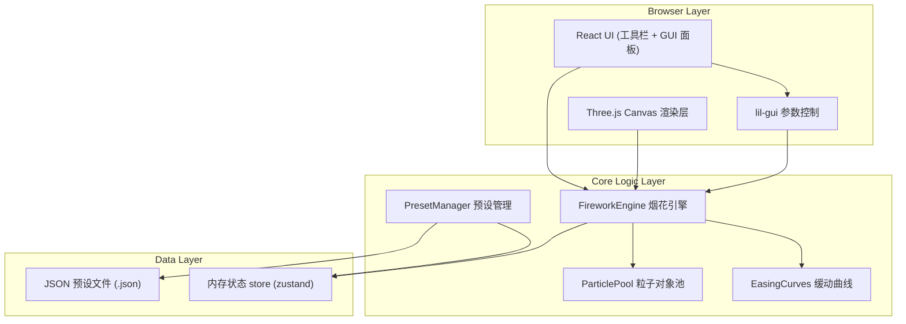

## 1. 架构设计



## 2. 技术说明
- **前端**：React@18 + Vite@5 + TypeScript@5
- **3D 渲染**：three@0.160 + @react-three/fiber@8 + @react-three/drei@9
- **GUI 控制**：lil-gui@0.19 (轻量级参数调节面板)
- **状态管理**：zustand@4 (轻量全局状态，存储烟花参数与运行状态)
- **后期效果**：@react-three/postprocessing + postprocessing (Bloom 泛光)
- **样式**：tailwindcss@3
- **无后端 / 无数据库**：纯前端应用，数据通过 JSON 文件本地导入导出
- **容器化**：Docker + docker-compose + nginx (提供生产构建静态服务)

## 3. 目录结构

```
tl-0099-1/
├── src/
│   ├── components/
│   │   ├── SceneCanvas.tsx      # 3D 场景主组件
│   │   ├── NightSky.tsx          # 夜空背景与星空
│   │   ├── Firework.tsx          # 单组烟花渲染组件
│   │   ├── ControlPanel.tsx      # 顶部工具栏
│   │   ├── GUIPanel.tsx          # lil-gui 面板封装
│   │   └── VelocityArrow.tsx     # 粒子速度向量箭头
│   ├── engine/
│   │   ├── FireworkEngine.ts     # 烟花引擎核心（发射、burst、生命周期）
│   │   ├── ParticlePool.ts       # 粒子对象池复用
│   │   └── EasingCurves.ts       # 缓动函数集合
│   ├── store/
│   │   └── useFireworkStore.ts   # zustand 全局状态
│   ├── utils/
│   │   ├── presetValidator.ts    # 预设 JSON 校验逻辑
│   │   └── colorUtils.ts         # 颜色渐变工具
│   ├── types/
│   │   └── index.ts              # TypeScript 类型定义
│   ├── App.tsx
│   ├── main.tsx
│   └── index.css
├── public/
├── Dockerfile
├── docker-compose.yml
├── nginx.conf
├── DOCS.md                       # easing 公式与参数说明文档
├── package.json
├── vite.config.ts
├── tailwind.config.js
└── tsconfig.json
```

## 4. 核心数据模型

```typescript
// 烟花预设参数
interface FireworkPreset {
  name: string;
  version: string;
  launch: {
    burstCount: number;           // 粒子数量 (80-1500)
    launchHeight: number;         // 升空高度
    launchDuration: number;       // 升空时长 (秒)
    launchInterval: number;       // 多组发射间隔 (秒)
  };
  burst: {
    radius: number;               // 开花半径
    duration: number;             // 开花持续时间
    trailLength: number;          // 拖尾时长
    gravity: number;              // 重力系数
  };
  color: {
    gradient: [string, string, string]; // 颜色渐变 [起点, 中点, 终点]
    hueVariation: number;         // 色相随机偏移
  };
  easing: {
    launchEase: string;           // 升空缓动函数名
    burstEase: string;            // 开花缓动函数名
    fadeEase: string;             // 消散缓动函数名
  };
}

// 运行时粒子数据
interface Particle {
  id: number;
  position: THREE.Vector3;
  velocity: THREE.Vector3;
  initialPosition: THREE.Vector3;
  targetPosition: THREE.Vector3;
  color: THREE.Color;
  alpha: number;
  size: number;
  age: number;
  maxAge: number;
  phase: 'launch' | 'burst' | 'fade';
  active: boolean;
}
```

## 5. 缓动曲线 (Easing) 实现要点

| 函数名 | 公式 | 用途 |
|--------|------|------|
| easeOutCubic | `f(t) = 1 - (1-t)³` | 升空阶段：初始快后减速上升 |
| easeOutQuart | `f(t) = 1 - (1-t)⁴` | 开花扩散：快速爆开后趋于平缓 |
| easeInOutQuad | `f(t) = t<0.5 ? 2t² : 1-(-2t+2)²/2` | 通用过渡 |
| easeOutExpo | `f(t) = t===1 ? 1 : 1-2^(-10t)` | 拖尾淡出：快速消散余辉 |
| easeInCubic | `f(t) = t³` | 重力加速下落 |

## 6. 性能策略
1. **BufferGeometry + PointsMaterial**：批量粒子，draw call 最小化
2. **对象池 (ParticlePool)**：粒子复用，避免频繁 GC
3. **AdditiveBlending**：加法混合模拟发光，无需光照计算
4. **InstancedMesh**：如扩展到多烟花并行时使用
5. **最大粒子上限**：单 burst 限制 1500，全局并发限制可配置
